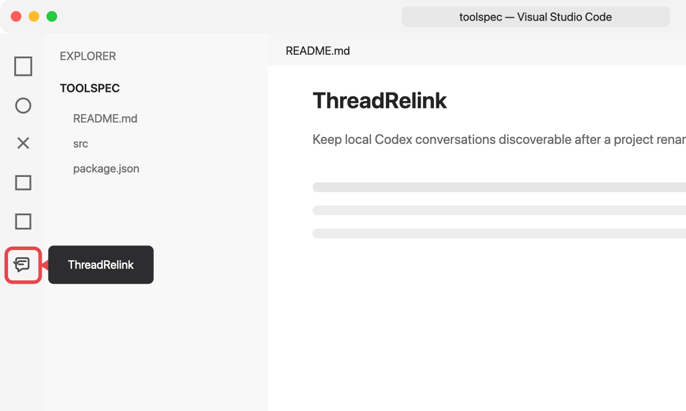
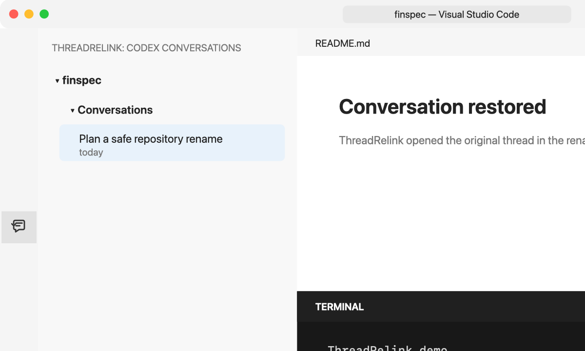

# ThreadRelink

> [English version](README.md) is also available.

<p align="center">
  
</p>

<p align="center">
  <a href="https://github.com/ascendho/ThreadRelink/actions/workflows/ci.yml"></a>
  <a href="https://marketplace.visualstudio.com/items?itemName=ascendho.threadrelink"></a>
  <a href="https://marketplace.visualstudio.com/items?itemName=ascendho.threadrelink"></a>
  <a href="https://github.com/ascendho/ThreadRelink/releases/latest"></a>
  <a href="LICENSE"></a>
</p>

ThreadRelink 是一个本地 VS Code 扩展，全部操作都可以通过侧边栏、右键菜单和 VS Code 命令面板完成。项目文件夹改名或移动后，它仍然可以把原来的 Codex 对话连接到这个项目。Codex 会记录对话开始时的工作目录。例如把 `toolspec` 改成 `finspec` 后，按路径筛选的恢复列表可能不再显示旧对话，但聊天文件实际上仍在本机。ThreadRelink 给项目分配一个不随路径变化的本地 UUID，记录新旧路径，并从新目录继续原线程。

## ThreadRelink 的工作原理

ThreadRelink 不会移动或重写 Codex 对话。它只在本机维护一个小型索引，把不随路径变化的项目身份与 Codex 已经提供的对话元数据连接起来。

```text
设置项目
   ↓
稳定的项目 UUID
   ↓
读取本地 Codex 元数据
   ↓
保守匹配
   ↓
ThreadRelink 本地 registry
   ↓
在项目当前路径继续原对话
```

### 1. 给项目一个不依赖路径的身份

选择 **Set Up This Project** 后，ThreadRelink 会为项目生成随机 UUID：

- Git 项目把 `threadrelink.projectId` 写入本地 `.git/config`，不会提交或推送；
- 普通独立目录把 UUID 写入目录内的 `.threadrelink/project.json`；
- 如果工作区位于一个更大的 Git 仓库中，一定会让用户选择当前文件夹还是父仓库才是项目边界。

这个身份会跟随项目目录移动，因此把 `/work/toolspec` 改名或移动到 `/archive/finspec` 后，ThreadRelink 仍会把它识别为同一个项目。

### 2. 通过本地 Codex app-server 读取元数据

用户对当前 VS Code profile 授权，并明确设置项目后，插件通过本机标准输入输出启动已安装的 `codex app-server`。它向 Codex 请求活动及已归档对话列表，只保留匹配所需的元数据：thread ID、标题/预览、时间、原工作目录、归档状态、Codex 版本、模型提供方，以及可用的 Git remote 和 commit 信息。

ThreadRelink 不会解析 transcript 文件，也不会请求完整消息正文。每次扫描结束后都会关闭 app-server 进程。

### 3. 使用保守证据进行匹配

证据按强弱处理：

| 证据 | 处理方式 |
| --- | --- |
| 已有明确链接，或记录的 cwd 位于项目已知路径中 | 自动链接 |
| Git remote 相同，且原对话 commit 在当前仓库中可达 | 自动链接 |
| 只有 remote 或只有 commit 相同 | 显示候选，等待用户确认 |
| 只有新旧目录名称相同 | 只显示低置信度候选 |
| 用户已从当前项目移除该对话 | 保持忽略，直到用户明确恢复 |

如果 Git remote 冲突，即使路径处于某个大型父仓库内，也不会让父仓库误领该对话。ThreadRelink 绝不会仅凭目录名称自动关联。

### 4. 记录路径并识别项目迁移

ThreadRelink 在 `~/.threadrelink/registry.json` 中保存项目记录、新旧路径别名、缓存的对话元数据、已确认链接和项目范围内的忽略记录。更新 registry 时会使用本地锁和原子文件替换。

如果同一个 UUID 出现在一个从未记录过的路径，ThreadRelink 会把它添加为新路径别名。首次在该位置扫描时会生成迁移报告，列出原项目路径，以及每个已链接对话最终选择的恢复路径。

### 5. 安全保留原来的相对子目录

每个链接都可以记录对话工作目录相对于项目根目录的位置，例如：

```text
原工作目录：  /work/toolspec/packages/api
保存的相对路径：packages/api
新项目根目录：/archive/finspec
恢复工作目录：/archive/finspec/packages/api
```

恢复前，ThreadRelink 会解析真实文件系统路径，确认目标仍然存在、确实是目录，并且没有离开当前项目。如果目录缺失、目标变成文件、包含 `..` 越界，或符号链接指向项目外部，它会显示警告并安全退回项目根目录。

最后，插件在 VS Code 集成终端中运行 `codex resume --cd <解析后的路径> <thread-id>`。对话本身仍完全由 Codex 管理。

### 6. 让用户纠错持续有效

从当前项目移除对话时，只会为这个项目保存忽略记录，避免下一次扫描立刻把它重新加回来。把对话移动到另一个已登记项目时，会在新项目建立明确链接，并防止旧项目再次认领。恢复对话则会清除相应的忽略记录。

## VS Code 图文使用方法

### 1. 从插件市场安装

在 VS Code 扩展页面搜索 **ThreadRelink**，或者运行：

```bash
code --install-extension ascendho.threadrelink
```

只要 VS Code 没有关闭扩展自动更新，通过 Marketplace 安装后就会自动获得新版。

> `pnpm` 仅供贡献者开发和离线打包使用，不是 ThreadRelink 面向用户的 CLI。从 Marketplace 安装插件的用户不需要运行它。

本地开发或离线打包时，先运行 `pnpm package:vscode`。然后按 `⌘⇧P`（Windows/Linux 为 `Ctrl+Shift+P`），运行 **Extensions: Install from VSIX...**，选择 `packages/vscode/threadrelink.vsix`。


### 2. 打开 ThreadRelink

点击左侧活动栏中的 ThreadRelink 图标。如果图标被隐藏，右键单击活动栏并勾选 **ThreadRelink**，或者运行 `ThreadRelink: Open Conversations View`。



### 3. 为项目执行一次设置

打开原项目，选择 **Set Up This Project**。

- 每个 VS Code profile 只请求一次元数据授权；
- 每个新项目仍然必须单独设置；
- 如果文件夹位于更大的 Git 仓库中，ThreadRelink 一定会让你选择项目边界。

Git 项目的稳定 UUID 写入本地 `.git/config`；独立目录使用 `.threadrelink/project.json`。两个位置都不保存 Codex 消息。


### 4. 改名或移动文件夹

结束当前 Codex 会话，关闭终端和工作区，然后在父目录中改名：

```bash
mv toolspec finspec
```

用 VS Code 打开 `finspec`。如果列表没有立即更新，点击 ThreadRelink 的刷新按钮。

### 5. 继续原来的聊天

展开 **Codex Conversations**，将鼠标移到目标对话上并点击继续图标。如果原对话从项目子目录启动，ThreadRelink 会在项目移动后保留该相对目录。如果子目录已不存在，它会提示并安全地退回项目根目录。随后在集成终端中运行：

```bash
codex resume --cd /new/path/finspec <thread-id>
```




## 侧边栏会显示什么

- 未设置的文件夹只显示设置入口，不会显示全局 conversations；
- 主 **Conversations** 区域只显示当前项目的对话；
- 候选和无关对话只会在主动运行 **Find Old Conversations** 后出现；
- 右键点击已链接对话，可将其从当前项目移除并忽略，或改绑到另一个已登记项目；
- 已忽略对话可通过 **Find Old Conversations** 重新链接；
- 首次发现新的项目路径时，会提供迁移报告，列出每个对话的原目录和恢复目录；
- 如果安装 ThreadRelink 前已经改名，可使用 **Relink Previous Project Path** 手动输入旧路径。
- **Forget Project** 只会在确认后删除 ThreadRelink 身份和链接，绝不会删除 Codex transcript。

ThreadRelink 不会自动把嵌套文件夹当成父级 Git 仓库。

## 本地数据与隐私

| ThreadRelink | 具体内容 |
| --- | --- |
| 读取 | Codex 列表元数据、项目身份、本地路径、Git remote 和 commit 信息 |
| 写入 | 项目 UUID 和 `~/.threadrelink/registry.json` |
| 绝不会 | 上传数据、提供遥测、写入 `~/.codex`、修改 Codex 数据库或 transcript、复制完整消息正文 |

没有明确设置项目并授权前，ThreadRelink 不会扫描对话元数据。registry version 1 会在下次更新时自动迁移到 version 2。写入 version 2 后，ThreadRelink 0.4 可能无法继续读取，因此不建议降级。

## 安全

ThreadRelink 只在本机运行，没有遥测或网络服务。它通过本地 Codex app-server 读取 Codex 对话元数据，并在 `~/.threadrelink` 中保存少量项目和对话索引。请勿在公开 Issue 中附加 `registry.json`、Codex transcript 或未脱敏的绝对路径。如果你认为发现了安全漏洞，请使用[GitHub 私密漏洞报告](https://github.com/ascendho/ThreadRelink/security/advisories/new)，不要创建公开 Issue。

## 反馈与贡献

欢迎提交 [Issue](https://github.com/ascendho/ThreadRelink/issues) 和 [Pull Request](https://github.com/ascendho/ThreadRelink/pulls)：

- Issue 可用于反馈可复现的 Bug、功能建议和使用体验；提交前请先搜索已有 Issue；
- 截图和诊断信息必须移除绝对路径，绝不要上传 ThreadRelink registry 或 Codex transcript；
- Pull Request 应保持聚焦，说明对用户的影响，更新相关测试或文档，并在提交前运行 `pnpm check`。
