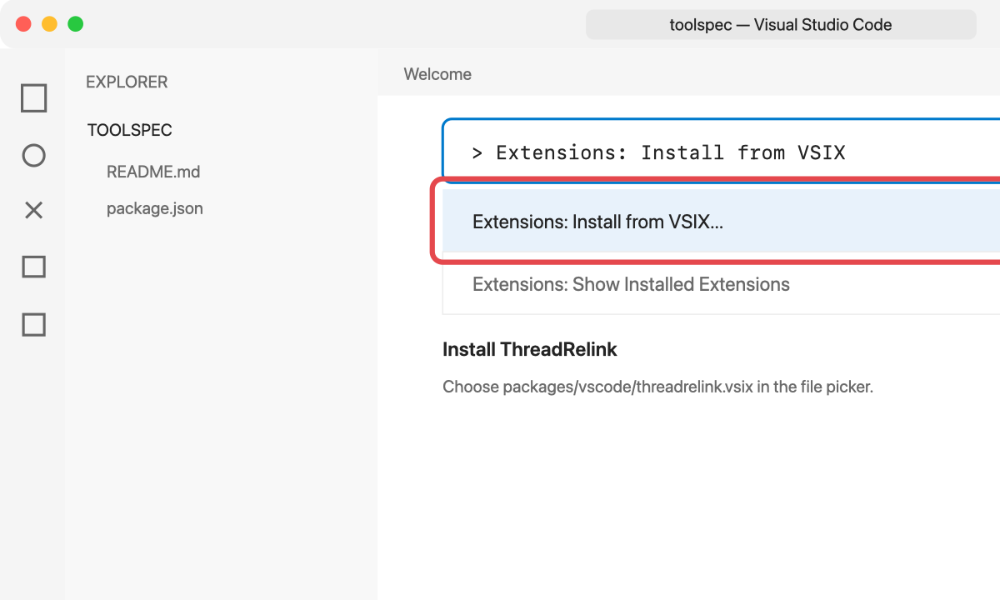
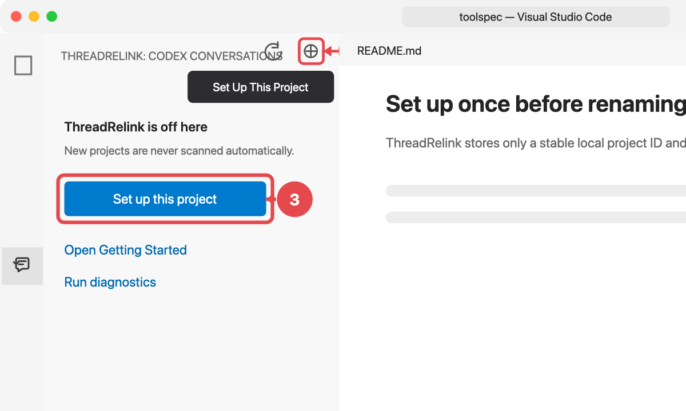
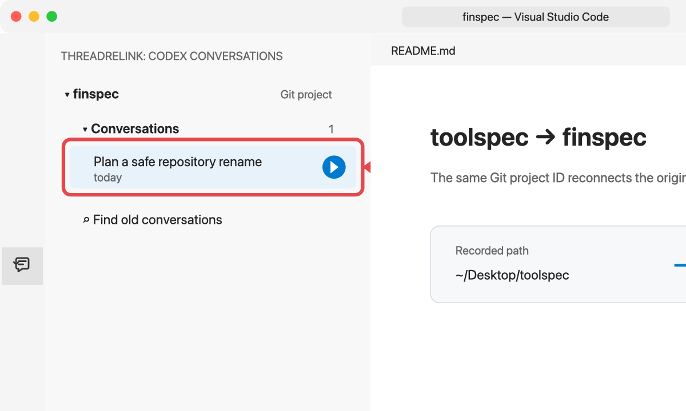

# ThreadRelink

[English](README.md)

<p align="center">
  
</p>

<p align="center">
  <a href="https://github.com/ascendho/ThreadRelink/actions/workflows/ci.yml"></a>
  <a href="https://marketplace.visualstudio.com/items?itemName=ascendho.threadrelink"></a>
  <a href="https://marketplace.visualstudio.com/items?itemName=ascendho.threadrelink"></a>
  <a href="LICENSE"></a>
</p>

ThreadRelink 是一个本地 VS Code 扩展和 CLI。项目文件夹改名或移动后，它仍然
可以把原来的 Codex 对话连接到这个项目。

Codex 会记录对话开始时的工作目录。例如把 `toolspec` 改成 `finspec` 后，按路径
筛选的恢复列表可能不再显示旧对话，但聊天文件实际上仍在本机。ThreadRelink
给项目分配一个不随路径变化的本地 UUID，记录新旧路径，并从新目录继续原线程。

> ThreadRelink 是独立项目，不是 OpenAI 官方 Codex 扩展，也不会替代 Codex
> CLI。

## VS Code 图文使用方法

### 1. 从插件市场安装

在 VS Code 扩展页面搜索 **ThreadRelink**，或者运行：

```bash
code --install-extension ascendho.threadrelink
```

只要 VS Code 没有关闭扩展自动更新，通过 Marketplace 安装后就会自动获得新版。

本地开发或离线安装时，先运行 `pnpm package:vscode`。然后按
`⌘⇧P`（Windows/Linux 为 `Ctrl+Shift+P`），运行
**Extensions: Install from VSIX...**，选择
`packages/vscode/threadrelink.vsix`。



### 2. 打开 ThreadRelink

点击左侧活动栏中的 ThreadRelink 图标。如果图标被隐藏，右键单击活动栏并勾选
**ThreadRelink**，或者运行 `ThreadRelink: Open Conversations View`。


### 3. 为项目执行一次设置

打开原项目，选择 **Set Up This Project**。

- 每个 VS Code profile 只请求一次元数据授权；
- 每个新项目仍然必须单独设置；
- 如果文件夹位于更大的 Git 仓库中，ThreadRelink 一定会让你选择项目边界。

Git 项目的稳定 UUID 写入本地 `.git/config`；独立目录使用
`.threadrelink/project.json`。两个位置都不保存 Codex 消息。



### 4. 改名或移动文件夹

结束当前 Codex 会话，关闭终端和工作区，然后在父目录中改名：

```bash
mv toolspec finspec
```

用 VS Code 打开 `finspec`。如果列表没有立即更新，点击 ThreadRelink 的刷新按钮。

### 5. 继续原来的聊天

展开 **Codex Conversations**，将鼠标移到目标对话上并点击继续图标。
ThreadRelink 会在集成终端中运行：

```bash
codex resume --cd /new/path/finspec <thread-id>
```




## 侧边栏会显示什么

- 未设置的文件夹只显示设置入口，不会显示全局 conversations；
- 主 **Conversations** 区域只显示当前项目的对话；
- 候选和无关对话只会在主动运行 **Find Old Conversations** 后出现；
- 如果安装 ThreadRelink 前已经改名，可使用
  **Relink Previous Project Path** 手动输入旧路径。

ThreadRelink 不会自动把嵌套文件夹当成父级 Git 仓库。

## 从 RepoRecall 迁移

ThreadRelink `0.4.0` 可以识别以下旧数据：

- `~/.reporecall/registry.json`
- Git 本地配置中的 `reporecall.projectId`
- `.reporecall/project.json`
- `REPORECALL_HOME` 和 `REPORECALL_CODEX_PATH`

如果新位置还没有数据，ThreadRelink 会验证旧数据，并使用相同 UUID 将其复制到
新命名空间。已有的新数据不会被覆盖，旧文件也会保留，方便回退。

新版 VS Code 扩展使用新的扩展 ID。安装 ThreadRelink 后，请卸载旧的 RepoRecall
VSIX，避免活动栏同时出现两个入口。VS Code 会重新询问一次元数据授权，但这不会
影响 Codex 聊天文件和已经迁移的项目关联。

旧的 `reporecall` CLI 和命令别名会继续兼容一个版本。

## CLI

要求：

- Node.js 22 或更高版本
- Git（用于仓库身份）
- Codex CLI 0.145.0 或更高版本

```bash
npx @ascendho/threadrelink init
threadrelink init
threadrelink init ./nested-folder --as-directory
threadrelink init ./nested-folder --use-parent-repo
threadrelink sync
threadrelink list
threadrelink relink --from /old/path/toolspec --to /new/path/finspec
threadrelink resume <thread-id> --cwd /new/path/finspec
threadrelink forget /mistaken/project
threadrelink doctor
```

可用 `--codex-path` 或 `THREADRELINK_CODEX_PATH` 指定 Codex；可用
`--registry-home` 或 `THREADRELINK_HOME` 指定本地状态目录。

## 匹配规则

ThreadRelink 的自动匹配比较保守：

1. 已有显式链接或已知路径：自动关联；
2. Git remote 相同，并且记录的 commit 在当前仓库中可达：自动关联；
3. 只有 remote 或 commit 相同：显示候选并等待确认；
4. 只有目录名相似：绝不自动关联。

`Forget Project` 只会在确认后删除 ThreadRelink 身份和链接，不会删除缓存的
conversation 元数据或 Codex 聊天文件。

## 隐私

- 仅读取 thread ID、标题/预览、时间、记录的 cwd、归档状态和 Git 元数据；
- 不复制消息正文；
- 不上传数据，没有遥测或云端服务；
- 不写入 `~/.codex`，不修改 Codex 数据库；
- 未明确设置项目并授权前，不扫描 conversation 元数据。

## 开发

这是一个 pnpm workspace：

- `packages/core`：稳定身份、registry、匹配和 Codex JSON-RPC；
- `packages/cli`：项目及对话命令；
- `packages/vscode`：Tree View、内置教程和集成终端恢复。

```bash
pnpm install
pnpm check
pnpm package:vscode
```

CI 会在 macOS、Linux 和 Windows 上运行检查并打包 VSIX。
只有版本匹配的 `vX.Y.Z` GitHub Release 才会触发 Marketplace 发布。一次性身份
配置和后续发布步骤见 [Marketplace 发布指南](docs/MARKETPLACE_PUBLISHING.md)。

## License

MIT
