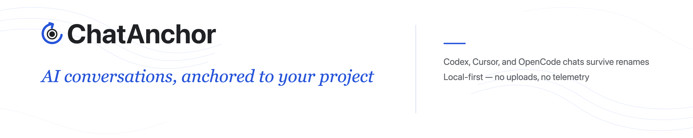

# ChatAnchor

> 中文：[README.md](README.md)



[](https://github.com/ascendho/ChatAnchor/actions/workflows/ci.yml)
[](https://github.com/ascendho/ChatAnchor/releases/latest)
[](LICENSE)

ChatAnchor is a local VS Code extension: after a project folder is renamed or moved, it reconnects your original **Codex**, **Cursor Agent CLI**, and **OpenCode** conversations to that project and resumes the original thread from the new location. The project gets a path-independent local UUID, so old conversations do not "disappear" just because of a rename.

> Name note: this extension was formerly **ThreadRelink** and is now **ChatAnchor**. Marketplace extension IDs cannot change after publishing, so the Marketplace URL and extension ID remain `ascendho.threadrelink`, and command/setting prefixes remain `threadrelink.*`.

## Features

- Supports **Codex**, **Cursor Agent CLI**, and **OpenCode** conversations
- Automatically reconnects after a project is renamed or moved, based on conservative evidence such as Git remote + commit and path aliases — never links by directory name alone
- One-click resume of the original conversation: `codex resume --cd`, `agent --resume --workspace`, `opencode <new-path> --session`
- Copy @ Path / Reveal conversation files (Codex, Cursor)
- Custom conversation descriptions for long, noisy, or generic titles
- Hide conversations you do not need right now, show hidden items on demand, and unhide them later
- Find Old Conversations to recover old conversations and relink ignored conversations
- Advanced link fixes: right-click **Manage Conversation Link...** to move a mislinked conversation, or remove and ignore it for the current project
- Runs entirely locally — no telemetry, nothing uploaded

> **OpenCode** conversations have no standalone file (they live in the local `opencode.db`), so Reveal / Copy @ Path is not available for them; ChatAnchor resumes them by running `opencode <new-path> --session <id>` with the current project path.

## Getting started

> [!NOTE]
> ChatAnchor only reads local metadata. It never uploads data and never reads message bodies. Before first use, you must explicitly grant consent and set up each project.

1. **Install the extension**
   - Install from the [Visual Studio Marketplace](https://marketplace.visualstudio.com/items?itemName=ascendho.threadrelink), or run:
     ```bash
     code --install-extension ascendho.threadrelink
     ```
   - Or download the latest VSIX from [GitHub Releases](https://github.com/ascendho/ChatAnchor/releases/latest) and run:
     ```bash
     code --install-extension threadrelink.vsix
     ```

2. **Open the ChatAnchor view**: click the ChatAnchor icon in the Activity Bar; if it is hidden, right-click the Activity Bar and enable **ChatAnchor**.

3. **Enable metadata scan**: click "Enable Local Metadata Scan" to allow reading local **Codex** / **Cursor** / **OpenCode** conversation metadata. Projects are never scanned without explicit consent.

4. **Set up the current project**: click "Set Up This Project". If the folder is inside a parent Git repository, you will be asked to choose an independent directory identity or the parent repository identity.

5. **Rename and reopen the folder**: close the Codex terminal, rename the folder outside VS Code, reopen it, then click "Refresh Conversations".

6. **Resume the original conversation**: hover a conversation row and click the continue icon. ChatAnchor opens an integrated terminal running `codex resume --cd <new-path> <thread-id>`, `agent --resume <chat-id> --workspace <new-path>`, or `opencode <new-path> --session <id>` at the new path.

7. **Organize the list**: right-click a conversation to edit its description or hide it. The title bar can temporarily show hidden conversations, and can unhide all hidden conversations in the current project.

## Link Management Examples

For everyday list cleanup, use **Hide Conversation**. Use link management only when a conversation belongs to the wrong ChatAnchor project:

- **Restore a link**: an old conversation did not appear under the current project. Click the title-bar search icon, **Find Old Conversations**, choose a suggested conversation, then confirm **Link conversation**.
- **Restore an ignored conversation**: you removed the link by mistake. Open **Find Old Conversations**, choose **Review ignored conversations...**, then link it again.
- **Move a link**: a conversation is attached to the wrong project. Right-click it and choose **Manage Conversation Link...** → **Move Link to Another Project**.
- **Remove and ignore a link**: a conversation does not belong to this project and should not auto-match again. Right-click it and choose **Manage Conversation Link...** → **Remove Link and Ignore for This Project**.

## Local data and privacy

ChatAnchor runs entirely on your machine: it only reads conversation metadata (title, timestamps, working directory, Git info), never reads message bodies, uploads nothing, and has no telemetry. Scanning only happens after you explicitly set up a project and grant consent. Custom descriptions, hidden state, and project links are stored only in the local ChatAnchor registry; ChatAnchor does not modify the original Codex, Cursor, or OpenCode conversation data.

## Roadmap

ChatAnchor currently runs fully locally and uploads nothing. Cross-device conversation history sync (for example via a private sync folder or a self-hosted backend) is not implemented yet, but it is under consideration.

## Reporting bugs

Feedback is welcome. File reproducible bugs or feature requests in [GitHub Issues](https://github.com/ascendho/ChatAnchor/issues) — please search existing issues first. For security issues, use [GitHub private vulnerability reporting](https://github.com/ascendho/ChatAnchor/security/advisories/new) instead of a public issue.

## Feedback and contributing

Issues and pull requests are welcome:

- Contributions adding support for other coding agents (such as **Claude Code**, **Gemini CLI**, **GitHub Copilot**) are welcome; see the existing provider adapters in `packages/core/src/`;
- Remove absolute paths from screenshots and diagnostics; never upload ChatAnchor registry files, Codex transcripts, or unredacted local paths;
- Keep pull requests focused, describe the user impact, update tests or docs, and run `pnpm check` before submitting.
